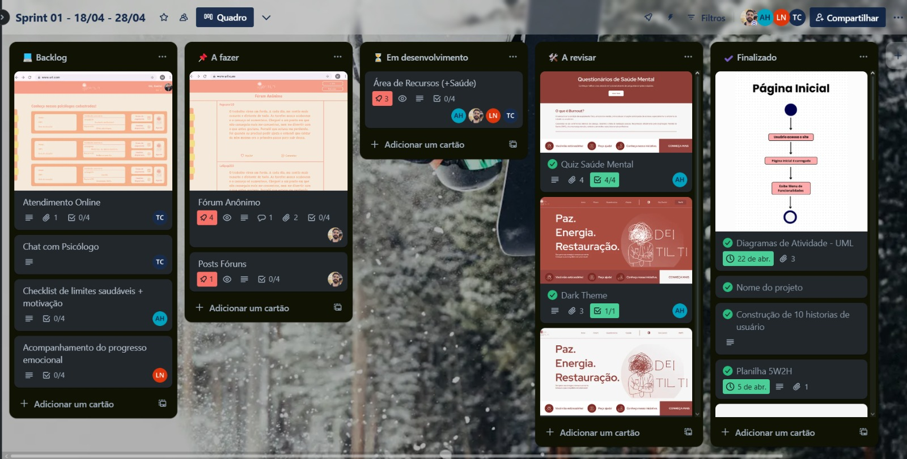
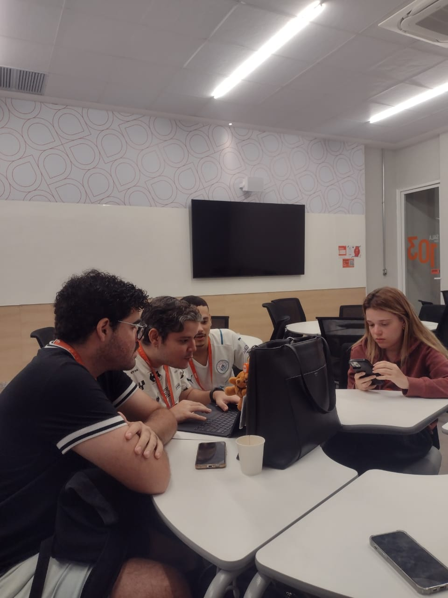

Dr ## 🧠 | Dei Tilti - Website

Aplicação desenvolvida com React como projeto acadêmico para a disciplina de **Projetos 2** na [CESAR School](https://www.cesar.school).

***

### 📑 | Índice

1. [Sobre o Projeto](#sobre-o-projeto)
2. [Backlog](#backlog-do-projeto)
3. [ScreenCast](#screencast)
4. [Links](#links-uteis)
5. [Tecnologias Utilizadas](#tecnologias-utilizadas)
6. [Acesse o Site](#acesse-o-site)
7. [Como Instalar?](#como-instalar)
8. [Issues](#Issues)
9. [Equipe](#equipe)
10. [Relatório de Desenvolvimento](#relatório)
11. [Licença](#licença)
12. [Como Contribuir](#como-contribuir)

*** 

### 📌 | Sobre o Projeto

Plataforma Web interativa para promover a saúde mental no trabalho. Com um fórum anônimo, chat de suporte e recursos educativos, oferece um ambiente seguro para troca de experiências e acesso a atendimentos online, ajudando na prevenção de problemas emocionais.

    Principais funcionalidades
    ✔️ Fórum Anônimo para compartilhar experiências, desabafos e comentários
    ✔️ Chat de Suporte e Atendimento Online com psicólogos cadastrados
    ✔️ Área de Recursos com dicas, notícias sobre burnout e checklist de limites saudáveis.
    ✔️ Questionários de Auto Avaliação
    

*** 

### 📑 | Backlog do Projeto

Link para o Trello, contendo todo o backlog do projeto.

[🔗 Trello](https://trello.com/b/FODA84Ao/lorem-ipsons)

Print dos quadros com as Sprints:

.jpg)

.jpg)

*** 

### 🎥 ScreenCast

Vídeo no YouTube apresentando as funcionalidades principais do site.

Minutos exatos do vídeo apresentando as funcionalidades contidos na descrição do vídeo.

[Screencast no YouTube](https://youtu.be/AYptshBXO7Q?si=WzMDX9upq5QId9Bk)

***

### ✔️ | Links Úteis

[🔗 Figma - Prototipação Navegável de baixa fidelidade!](https://www.figma.com/proto/v8qSHsqxcSn1YCFe0em4Wb/Dei-Tilti?node-id=118-50&p=f&t=6jSx9w5MhOaIrp9Y-1&scaling=min-zoom&content-scaling=fixed&page-id=0%3A1&starting-point-node-id=118%3A50)

[🔗 Canva - Design de alta fidelidade!](https://www.canva.com/design/DAGkIDK7g_c/iggZQvdKgD6SRUxeE1mv3A/edit?utm_content=DAGkIDK7g_c&utm_campaign=designshare&utm_medium=link2&utm_source=sharebuttonv)

[🔗 DOCS - Relatório de Desenvolvimento do Projeto!](https://docs.google.com/document/d/180YaCEbCrv_3SM8Rb_zrdJ8bSbknzEjNVU1qo71WdYM/edit)

[🔗 SITE - Link do Site](https://dei-tilti.netlify.app/)

***

### 💻 | Tecnologias Utilizadas

    React 
    JavaScript
    HTML e CSS
    Figma
    GitHub
    Trello
    Canva

*** 

### 🔥 | Acesse o Site

[**Link para o Site**](https://dei-tilti.netlify.app/)

*** 

### ❓ | Como instalar

E visualizar o andamento do site localmente?

Para visualizar o site em andamento, siga os passos abaixo:
        
1. Clone o repositório:

Primeiro, clone o repositório em seu computador usando o seguinte comando no terminal:
    
    git clone https://github.com/aline-henriques/PROJETO-2.git

2. Instale as dependências:

Navegue até o diretório do projeto e instale as dependências necessárias com o comando:
    
    cd PROJETO-2
    npm install

3. Inicie o servidor local:

Após a instalação das dependências, inicie o servidor de desenvolvimento com o comando:
    
    npm start

O site será aberto automaticamente no seu navegador. Caso não abra, acesse o endereço:
    
    http://localhost:3000

4. Veja o progresso:

O site estará rodando localmente, permitindo que você visualize as funcionalidades que já foram implementadas até o momento. :)

*** 

### 📌 Issues 

Acompanhe nossos issues através do link: 

[Issues](https://github.com/aline-henriques/PROJETO-2/issues)

*** 

### 👥 | Equipe

Programação em par experimentada 🚀
Acesse nossos issues e commits semanais.

    -  Aline de Albuquerque Henriques
    -  Bruno Felipe de Castilhos Gomes Rego  
    -  Luiz Henrique da Silva Neves  
    -  Thyalles Araújo Campos

*** 

### ✍🏻 | Relatório
   
Documento para relatório de desenvolvimento, desde o início á conclusão do projeto.

[Acesse aqui o nosso relatório de desenvolvimento COMPLETO!](https://docs.google.com/document/d/180YaCEbCrv_3SM8Rb_zrdJ8bSbknzEjNVU1qo71WdYM/edit?usp=drivesdk)

### 💡 | Programação em Equipe

Acesse mais informações sobre a nossa equipe no documento acima! 

***

### ⚖️ | Licença

Distribuído sob a **Licença MIT**.  
Consulte o arquivo [LICENSE](LICENSE) para mais detalhes.

***

### 🤝 | Como contribuir

> Siga o passo a passo: 

1. Faça um fork deste repositório

2. Clone o seu fork na sua máquina.  
   `git clone https://github.com/seu-usuario/nome-do-repositorio.git`

3. Crie uma branch com a sua feature ou correção. Exemplo: `git checkout -b minha-feature`.

5. Commit suas mudanças. Exemplo: `git commit -m 'Nova funcionalidade'`.

6. Faça push para a sua branch. Exemplo: `git push origin minha-feature`.

9. Abra um Pull Request explicando suas alterações.

Sugestões, melhorias e correções são sempre bem-vindas! ☺
