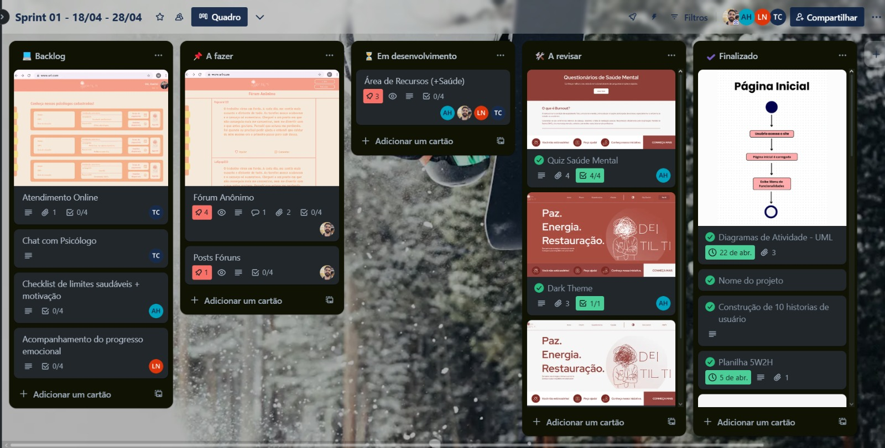
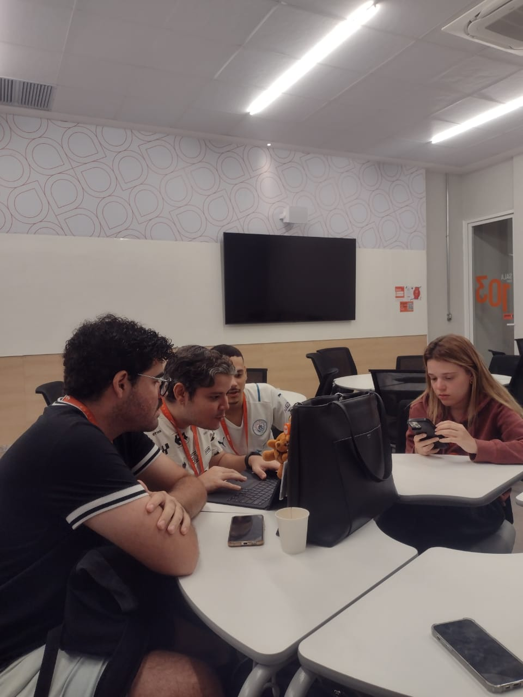

## 🧠 | Dei Tilti - Website

Aplicação desenvolvida com React como projeto acadêmico para a disciplina de **Projetos 2** na [CESAR School](https://www.cesar.school).

***

### 📑 | Índice

1. [Sobre o Projeto](#sobre-o-projeto)
2. [Backlog do Projeto](#backlog-do-projeto)
3. [ScreenCast](#screencast)
4. [Links](#links-uteis)
5. [Tecnologias Utilizadas](#tecnologias-utilizadas)
6. [Acesse o Site](#acesse-o-site)
7. [Como Instalar?](#como-instalar)
8. [Issues](#Issues)
9. [Equipe](#equipe)
10. [Licença](#licença)
11. Programação em Par(#Em-Par)

*** 

### 📌 | Sobre o Projeto

Plataforma Web interativa para promover a saúde mental no trabalho. Com um fórum anônimo, chat de suporte e recursos educativos, oferece um ambiente seguro para troca de experiências e acesso a atendimentos online, ajudando na prevenção de problemas emocionais.

    Principais funcionalidades
    ✔️ Fórum Anônimo para compartilhar experiências, desabafos e comentários
    ✔️ Chat de Suporte e Atendimento Online com psicólogos cadastrados
    ✔️ Questionários de Auto Avaliação

*** 

### 📑 | Backlog do Projeto

Link para o Trello, contendo todo o backlog do projeto.

[🔗 Trello](https://trello.com/b/FODA84Ao/lorem-ipsons)

Print dos nossos quadros!

*** 

### 🎥 ScreenCast

Vídeo no YouTube, apresentando as funcionalidades principais do site.

Minutos exatos do vídeo, apresentando as funcionalidades:

**00:05 - Tela Inicial**

**00:21 - Mudança de Tema (dark/light theme)**

**00:34 - Questionários de Autoavaliação**

[Screencast no YouTube](https://youtu.be/AYptshBXO7Q?si=WzMDX9upq5QId9Bk)

***

### ✔️ | Links Úteis
[🔗 GitHub - Repositório do nosso projeto!](https://github.com/aline-henriques/PROJETO-2)

[🔗 Figma - Prototipação Navegável de baixa fidelidade!](https://www.figma.com/proto/v8qSHsqxcSn1YCFe0em4Wb/Dei-Tilti?node-id=118-50&p=f&t=6jSx9w5MhOaIrp9Y-1&scaling=min-zoom&content-scaling=fixed&page-id=0%3A1&starting-point-node-id=118%3A50)

[🔗 Canva - Design do projeto de alta fidelidade!](https://www.canva.com/design/DAGkIDK7g_c/iggZQvdKgD6SRUxeE1mv3A/edit?utm_content=DAGkIDK7g_c&utm_campaign=designshare&utm_medium=link2&utm_source=sharebuttonv)

[🔗 DOCS - Relatório de Desenvolvimento!](https://docs.google.com/document/d/180YaCEbCrv_3SM8Rb_zrdJ8bSbknzEjNVU1qo71WdYM/edit)

[🔗 Diagramas de Atividade UML!](https://www.canva.com/design/DAGlzQsGeGw/ckztLZvsKIfwOUF001ynJw/edit?utm_content=DAGlzQsGeGw&utm_campaign=designshare&utm_medium=link2&utm_source=sharebutton)

***

### 💻 | Tecnologias Utilizadas

    React 
    JavaScript
    HTML e CSS
    Figma
    GitHub
    Trello
    Canva

*** 

### 🔥 | Acesse o Site

[**Projeto em andamento...**](https://link-do-site.com)

✔️ Justificativa para o Não Deployment:

O projeto ainda está em início de desenvolvimento e não foi completamente finalizado. Estamos aguardando a implementação de funcionalidades-chave antes de realizar o deploy. O foco está em garantir que todas as partes essenciais do site sejam implementadas corretamente antes de ser disponibilizado publicamente.

✔️ Planos para o Projeto:

A estimativa de conclusão e o primeiro deploy do site está prevista para junho de 2025. Estamos planejando realizar testes de funcionalidade, usabilidade e responsividade antes de lançar o site. Nosso objetivo é garantir que o sistema seja bem implementado e funcional, oferecendo uma experiência de usuário de alta qualidade antes de torná-lo acessível ao público.

*** 

### ❓ | Como instalar
E visualizar o andamento do site localmente?

Para visualizar o site em andamento, siga os passos abaixo:
        
1. Clone o repositório:

Primeiro, clone o repositório em seu computador usando o seguinte comando no terminal:
    
    git clone https://github.com/aline-henriques/PROJETO-2.git

2. Instale as dependências:

Navegue até o diretório do projeto e instale as dependências necessárias com o comando:
    
    cd PROJETO-2
    npm install

3. Inicie o servidor local:

Após a instalação das dependências, inicie o servidor de desenvolvimento com o comando:
    
    npm start

O site será aberto automaticamente no seu navegador. Caso não abra, acesse o endereço:
    
    http://localhost:3000

4. Veja o progresso:

O site estará rodando localmente, permitindo que você visualize as funcionalidades que já foram implementadas até o momento. :)

*** 

### 📌 Issues 

Acompanhe nossos issues através do link: [Issues](https://github.com/aline-henriques/PROJETO-2/issues)

*** 
### 👥 | Equipe
Programação em par experimentada 🚀
Acesse nossos issues e commits semanais.

    -  Aline de Albuquerque Henriques
    -  Bruno Felipe de Castilhos Gomes Rego  
    -  Luiz Henrique da Silva Neves  
    -  Thyalles Araújo Campos

*** 
### | Programação

Relatório de Programação

* Grupo: Aline Henriques, Bruno Castilho, Luiz Henrique, Thyalles Campos.
* Projeto: Dei TIlti.
* Linguagem: JavaScript.

1. Objetivo
   
   Desenvolver uma aplicação web para usuários com burnout
   
2. Planejamento e Divisão de tarefas

   * Durante o desenvolvimento o grupo se dividiu de acordo com suas afinidades e agendas.
   
   * foram feitas reuniões por chamada de voz no Discord, para discutir, programar e revisar os códigos em tempo real.

4. Dificuldades

   * Encontramos difculdades para concilar nossos horários para nos encontrarmos o que impactou no ritmo do de desenvolvimento

   * Um dos integrantes teve dificuldades de realizar o push através do VsCode

5. Conclusão

   O projeto nos proporcionou um aprendizado valioso sobre programação, usabilidade e responsabilidade no desenvolvimento de ferramentas voltadas à saúde mental.
   consiguimos aplicar conceitos técnicos e humanos para entregar uma aplicação funcional e relevante socialmente.

### ⚖️ | Licença

Distribuído sob a **Licença MIT**.  
Consulte o arquivo [LICENSE](LICENSE) para mais detalhes.
